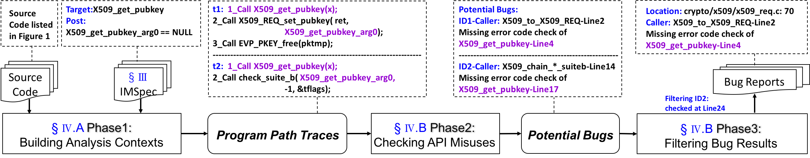

# IMChecker: AP{I} {M}isuse {Checker} for C Programs

> THU, IMChecker Group, contact us at guzx14@mails.tsinghau.edu.cn

### What is IMChecker?

Libraries offer reusable functionality through Application Programming Interfaces (APIs) with usage constraints, such as call conditions or orders. Constraint violations, i.e., [API misuses](http://sven-amann.de/publications/2018-03-A-Systematic-Evalution-of-Static-API-Misuse-Detectors/), commonly lead to bugs and security issues. Although researchers have developed various API-misuse detectors in the past few decades, recent studies show that API misuse is prevalent in real-world projects. The existing approaches either suffer from the sparse usage problem (i.e., bugs that rarely occur) or report false alarms due to inaccurate semantics. To overcome these limitations, we introduce IMChecker to effectively detect API-misuse bugs. The key insight behind IMChecker is a constraint-directed static analysis technique powered by a domain-specific language (DSL) for specifying API usage constraints. Through studying real-world API-misuse bugs, we propose IMSpec DSL, which covers a majority of the types of API usage constraints and enables simple but precise specification. Furthermore, we design and implement IMChecker to automatically parse IMSpec into checking targets and employ a static analysis engine to identify potential API misuses and prune false positives with rich semantics. We have instantiated IMChecker for C programs and evaluate it on widely used benchmarks and large-scale real-world programs.  

Currently, 60 previously unknown bugs have been found and 36 have been confirmed and fixed in Linux kernel, OpenSSL and packages in Ubuntu 16.04. We are trying our best to apply IMChecker to more programs.

Our research manuscript and tool manuscript are under review process of ICSE'19. We will upload them as soon as the review process finish. (Well, you can email us to access them by academic purpose only.)

Our tool demonstration video is available at https://youtu.be/YGDxeyOEVIM

Usage of our tools at [tools/Readme.md](tools/Readme.md)

IMChecker is still under development, and contains a lot of bugs and TODO lists. Any bugs or feature requests, feel free to email us at guzx14@mails.tsinghua.edu.cn or open issues.

### What is in this repo?

* Empirical study on API-misuse bugs ([empirical_study](empirical_study))
  * Gitgrabber: tool to extract commits based on approximate keyword matching
  * Commits related to API-misuse bugs in the studied subjects
* Evaluation data ([evaluation_data](evaluation_data))
  * API-Misuse-Benchmark
  * original evaluation result
  * New bugs found by IMChecker
* IMSpec used in this repository ([imspec](imspec))
* Tools([tools](tools))
  * IMChecker tookit
  * build-capture
* Lessons learned from IMChecker

### Empirical Study

To better understand what type of API-misuse bugs occur in real C projects and how developers fix them in practice, we manually studied two years’ version histories of three open-source projects and one-half year of Linux-kernel in 2017, as shown in the following table. These histories are chosen because of the ongoing development and because they are frequently mentioned in diverse bug detection works. In total, we have studied approximately 13.57M LOC and 51.1K commits. 

| Project | LOC | Studied Period | Total Commits | Bug Fixes | API Misuses |
| :-----: | :----: | :---------: | :--: | :--: | :--: |
| Curl | 112.8K | 20160101-20171231 | 2613 | 135 | 38 |
| GnuTLS | 35.8K | 20160101-20171231 | 2769 | 86 | 30 |
| OpenSSL| 454.2K | 20160101-20171231 | 6487 | 344 | 115 |
| Linux | 12.96M | 20170701-20171231 | 39295 | 995 | 362 |
| Total | 15.57M | Two years | 51.1K | 1560 | 509 |

To help readers extract the commits message, changed files and patch files, we open source our ***Gitgrabber*** tool. We also upload all the commits related to API-misuse bugs in the studied subjects for further use. 

Readers can find them in [empirical_study](empirical_study) folder. Any problems on Gitgrabber, please feel free to contact us!

### Evaluation Data

We select a widely used benchmark, i.e., [Juliet Test Suite V1.3](https://samate.nist.gov/SRD/testsuite.php), and two real-world programs in their latest versions: [Linux kernel-4.18-rc4](https://github.com/torvalds/linux/releases/tag/v4.18-rc4) released on 2018-7-9 and [OpenSSL-1-1-1-pre8](https://github.com/openssl/openssl/releases/tag/OpenSSL_1_1_1-pre8) released on 2018-6-20 to evaluate our approach.  We evaluate our approach from two perspectives.

- Controlled dataset. We employ 2317 API-misuse bug instances from the Juliet Test Suite. For each test case, it consists of an API-misuse bug and several correct usages. These cases are used for comparison with state-of-the-art methods in terms of false positives and false negatives. 
- New bugs in real-world programs. We also apply IMChecker to the latest versions of real-world programs to evaluate whether our approach can find new bugs.

We also test this cases on  [APISan](https://github.com/sslab-gatech/apisan)  a sanitizing API usages detection tool through semantic cross-checking and [Clang-SA](http://clang-analyzer.llvm.org/) an open-source static analysis tool .

We upload the API-Misuse-Benchmark and original results at [evaluation_data](evaluation_data).

#### New Bugs

The main motivation of IMChecker is to detect API-misuse bugs in real-world programs, namely, to determine whether IMChecker can find previously unknown bugs.  Therefore, we apply IMChecker to the latest versions of two well-known open-source programs: Linux kernel-4.18-rc4 and OpenSSL-1-1-1-pre8, and packages in Ubuntu 16.04. Target APIs are selected from the misused ones from the empirical study.

Up to now, 56 previously unknown bugs have been found and  36 have been confirmed by developers. 

|      Project      | Bugs |
| :---------------: | ---: |
|      OpenSSL      |   17 |
|       Linux       |   30 |
|        dma        |    1 |
|       exim        |    2 |
|      hexchat      |    2 |
|      httping      |    1 |
|     ipmitool      |    1 |
|   open-vm-tools   |    2 |
|    keepalived     |    2 |
| freeradius-server |    2 |
|       Total       |   60 |

We upload the details  in [evaluation_data/new_bugs](evaluation_data/new_bugs) 

### IMSpec

Behavioral specifications describing API usage constraints have been shown to be useful for developers to effectively utilize APIs as well as to cope with the sparse usage problem by ensuring the validation of usages of the target APIs. For example, Bodden present [CRYSL](http://drops.dagstuhl.de/opus/volltexte/2018/9215/) to bridge the cognitive gap between cryptography experts and developers. However, current specification languages are either designed for full program properties, such as [BLAST](https://doi.org/10.1007/978-3-540-27864-1_2), [JML](http://www.eecs.ucf.edu/~leavens/JML/index.shtml) or are too specific to be applied to generic API-usage detection, such as [SLIC](https://www.microsoft.com/en-us/research/publication/slic-a-specification-language-for-interface-checking-of-c/). We introduce a lightweight domain-specific language for API usage constraints named IMSpec. IMSpec simultaneously ensures that the target APIs are validated, even with few usages, and guides the misuse detection. An instance of IMSpec is a pattern filled with a set of constraints to correctly use the API, and any violation will result in a API-misuse bug. 

We upload the IMSpec instances into [impsec](imspec) folder, we will incrementally update this folder for more APIs. Besides, IMSpec can be used to other purpose, such as generate testing cases, verification and so on. Moreover, we provide a GUI IMSpec writer at [tools](tools ).

Currently, IMSpec is created by manual writing. However, we ensure that it can be generated automatically from specification mining techniques. We are trying our best to conduct experiments and implement parsers to translate the results from mining tools into IMSpec, such as [APEx](https://github.com/yujokang/APEx). But, these tools cannot solve all the usage constraints. We also would like to invite the developers to help us refine the IMSpec instances generated according to the user manual, such as [OpenSSL](https://www.openssl.org/docs/manmaster/man3/).

### Tools

#### IMChecker

A correct API-usage has to satisfy a set of usage constraints, that is, violations of the constraints may result in API-misuse bugs. IMChecker automatically detects these bugs in source code using the specifications of IMSpec. To process complex, real-world programs, IMChecker’s underlying mechanisms must be scalable while sacrificing the minimal amount of accuracy. We elaborate the design details of IMChecker, including under-constrained symbolic execution with static analysis techniques to build analysis context, methodologies to detect API-misuse bugs in the analysis context and a method to filter false positives using semantic information and usage statistics. 

We use a motivating example to illustrate the workflow of IMChecker. This is an API-misuse bug in OpenSSL reported in [CVE-2015-0288](https://nvd.nist.gov/vuln/detail/CVE-2015-0288). The missing error code check of `X509_get_pubkey()` resulted in a NULL Pointer Dereference bug at line-4.

```c
1 // Location: crypto/x509/x509_req.c: 70 2 X509_REQ *X509_to_X509_REQ(...){
3 ...
4 pktmp = X509 get pubkey(x);
5 // missing error code check of pktmp 
6 + if (pktmp == NULL)
7 + goto err;
8 i = X509_REQ_set_pubkey(ret, pktmp); 9 EVP_PKEY_free(pktmp);
10 ...
11 }
12
13 // Location: /crypto/x509/x509_cmp.c: 390 
14 int X509_chain_check_suiteb(...){
15 ...
16 // check error value in usage
17 pk = X509 get pubkey(x);
18 rv = check_suite_b(pk, -1, &tflags);
19 ...
20 }
21 // Location: /crypto/x509/x509_cmp.c: 359
22 static int check_suite_b(EVP_PKEY *pkey,...){ 23 ...
24 // ensure pkey not NULL
25 if (pkey && pkey->type == EVP PKEY EC)
26 ...// usage of pkey
27 }
```

Here is the workflow of IMChecker:



IMChecker takes the source code and API usage constraints as input and generates bug reports with concrete locations and reasons as output. First, API usage constraints are written in a lightweight domain-specific language named IMSpec; for example, ***“the return value of X509_get_pubkey() has to be checked with NULL”***. By employing these specifications, IMChecker directly validates the usages of the target API, which relieves the sparse usage problem and guides the bug detection process. Then, we detect API-misuse bugs in three phases. (1) In Phase-1, the analysis context is built by constructing the control flow graph and creating program path traces for each target API defined in the specifications by employing under-constrained symbolic execution with point-to, range and path-sensitive analysis. In this example, two traces, t1 and t2, are generated, as shown in the box above Program Path Traces. In this way, IMChecker can successfully capture the usage context of `X509_get_pubkey()`, `EVP_PKEY_free()` and those in between. (2) In Phase-2, IMChecker employs the traces to detect violations of the constraints as potential bugs. Forexample,twoAPI-misuse instances of `X509_get_pubkey()` are found for missing error code checks labeled as Potential Bugs. (3) In Phase-3, IMChecker improves the detection precision by leveraging multiple usage instances and the semantic information. Then, the second misuse is filtered out for the check conducted in the `X509_to_X509_REQ()` at Line-25. 

The usage of our tool can be found here: [tools/Readme.md](tools/Readme.md)

### Lessons learned from IMChecker

While investigating the bug reports generated by IMChecker, we find several interesting bugs and gain useful experience in the bug reporting process with open-source developers. We share our following experience. 

* **API misuses are not corner cases.** In total, we find 47 previously unknown bugs in APIs that have been previously misused in the same programs *(Note, we only use a littele part of the APIs)*. These bugs may result from the lack of a bug information sharing mechanism among developers and the lack of API usage specifications. We believe that bug fixing is an essential activity during the entire life cycle of software development. Automatic bug finding tools, such as IMChecker, with large-scale analysis capability can be integrated into the development cycle. The IMSpec used in IMChecker can be customized to incrementally address misuses. 
* **Accelerating manual auditing.** API misuses usually have similar behavior patterns. For example, many types of vulnerabilities result from insufficient validation of input or missing error code checks. However, discovering all the missing checks by human is tedious and time consuming. Automatic tools can efficiently accelerate the manual auditing with differences extracted as good usages and bad usages. For example, two of the API misuses were fixed within 8 hours after we created the issues with possible fixing patches, as shown in Figure 10. 
* **Intentional choices.** We also find that many misuses are not mistakes but intentional choices. Many error code checks of return values are ignored by developers. During the bug reporting process with the OpenSSL developers, we learned that they intentionally ignore some error code checks for performance considerations or due to the lack of an error handling mechanism in C. 

### Acknowledgement

The authors would like to thank the developers of Linux Kernel and OpenSSL to help us refine the IMSpec and confirm bug reports.